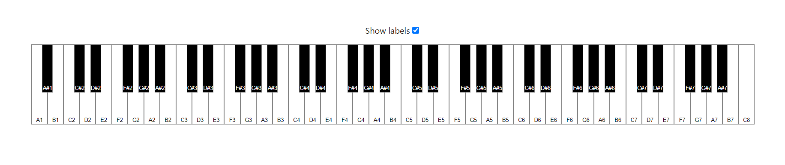

# react-etude-piano example

[Live interactive demo](https://andrewthehan.github.io/react-etude-piano/)

Interactive piano combining `react-etude-piano` with [@tonejs/piano](https://github.com/tambien/Piano).
